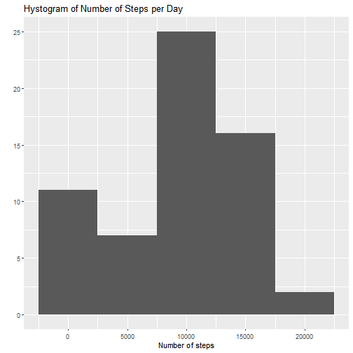
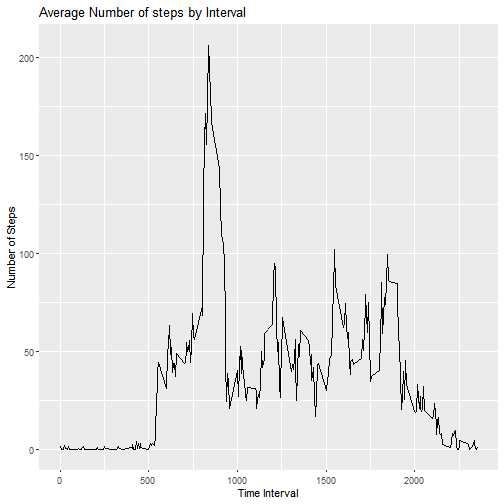
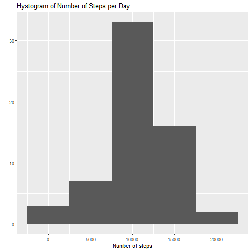
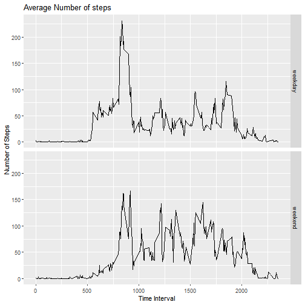

## Loading and preprocessing the data

In this step the data was loaded and the date variable was formatted as date.


```r
unzip("~/DATA_SCIENCE/reproducible_research/RepData_PeerAssessment1/activity.zip")
data <- read.csv("activity.csv")
data$date <- as.Date(data$date, "%Y-%m-%d")
```


## What is mean total number of steps taken per day?

In the next code chunk the total number of steps by day is computed, this data is used to calculate the mean and the median, and to plot a hystogram of total steps by day.


```r
library(ggplot2)
daily_steps <- tapply(data$steps, data$date, sum, na.rm = T)
mean <- mean(daily_steps, na.rm = T)
median <- median(daily_steps, na.rm = T)
qplot(daily_steps, binwidth=5000) + ggtitle("Hystogram of Number of Steps per Day") + xlab("Number of steps") 
```



The mean number of steps taken by day is 9354,23 and the median is 10395.

## What is the average daily activity pattern?

To compute the daily activity pattern the steps data is averaged across the days for each interval as showed in the code chunk below.


```r
library(plyr)
interval_mean <- ddply(data, .(interval), summarise, mean = mean(steps, na.rm = T))
ggplot(interval_mean, aes(interval, mean)) + geom_line() + ggtitle("Average Number of steps by Interval") + xlab("Time Interval") + ylab("Number of Steps")
```



```r
interval_mean$interval[which.max(interval_mean$mean)] ##compute interval with max numbers of steps
```

```
## [1] 835
```

The 5-minute interval with the maximum number of steps on average across all the days is 835, which refers to 8:35 AM interval.

## Imputing missing values

Next code computes the number of missing values.


```r
colSums(is.na(data))
```

```
##    steps     date interval 
##     2304        0        0
```

There are 2304 missing values in steps variable.

In the next code chunk a new variable is created, the values of this are assigned from the interval_mean dataframe computed previously and containing the mean number of steps by interval.


```r
data$new <- factor(as.character(data$interval), levels = as.character(interval_mean$interval), labels = as.character(interval_mean$mean))
```

Next code replaces missing data in steps variable with the corresponding values in the new variable.


```r
data$steps <- replace(data$steps,is.na(data$steps), as.numeric(as.character(data$new[is.na(data$steps)])))
```

Next part creates a new dataset equal to the original dataset but with the missing values filled in.


```r
dataset <- data[,1:3]
```

Next code chunk computes mean and median on number of steps by day, it also creates a hystogram of number of steps by day, all of these are computed with the new dataset. 


```r
daily_steps2 <- tapply(dataset$steps, dataset$date, sum, na.rm = T)
mean2 <- mean(daily_steps2, na.rm = T)
median2<- median(daily_steps2, na.rm = T)
qplot(daily_steps2, binwidth=5000) + ggtitle("Hystogram of Number of Steps per Day") + xlab("Number of steps") 
```



Since missing values were removed the mean and the median both changed, for this new dataset these two measures are both 10766.19. In the hystogram the frequency of the first bin has significantly decreased. When missing values are imputed there are not days in which the data steps is zero while in the original dataset days with missing values are zero.

## Are there differences in activity patterns between weekdays and weekends?

Next code chunk creates a new variable in the dataset, it classifies the days in weekdays and weekends. This code also plots the average number of steps by interval in weekdays and weekends.


```r
Sys.setlocale("LC_TIME", "English") ## set language time to English since it's originally in Spanish in my case
```

```
## [1] "English_United States.1252"
```

```r
dataset$day <- factor(weekdays(dataset$date) %in% c("Saturday", "Sunday"), levels = c(FALSE, TRUE), labels = c("weekday", "weekend"))
library(dplyr)
groups <- dataset %>% group_by(day, interval)  %>% summarise(mean_steps=mean(steps))
```

```
## `summarise()` regrouping output by 'day' (override with `.groups` argument)
```

```r
ggplot(groups, aes(interval, mean_steps)) + geom_line() + ggtitle("Average Number of steps") + xlab("Time Interval") + ylab("Number of Steps") + facet_grid(day ~ .)
```


